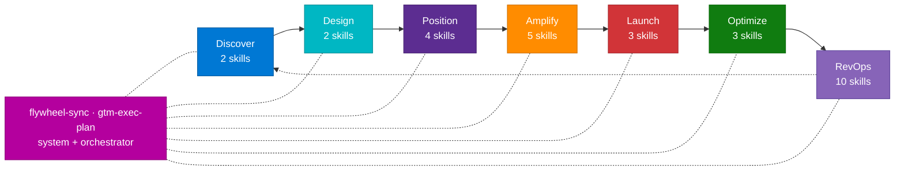

<div align="center">

# 🚀 AI GTM Skill Library

### A library of 31 opinionated GTM skills for Claude Code and GitHub Copilot

[](#-skills-catalog)
[](#-skills-catalog)
[](LICENSE)
[](docs/HOW-TO-USE.md)

</div>

---

## ⚡ Quickstart

```bash
# 1. Clone the repo
git clone https://github.com/varunk130/ai-gtm-skill-library.git

# 2. Install all 31 skills for Claude Code
mkdir -p ~/.claude/skills
cp -r ai-gtm-skill-library/skills/* ~/.claude/skills/

# 3. Restart Claude Code, then invoke a skill by name:
#      signal-radar          — macro-market signal detection
#      position-lock         — competitive positioning
#      launch-command        — full launch orchestration
#      flywheel-sync         — audit health of the full skill system
```

> First-time setup, GitHub Copilot integration, and FAQs are in the [How to Use Guide](docs/HOW-TO-USE.md).

---

## What this solves

GTM teams produce the same artifacts over and over — positioning frameworks, launch plans, battle cards, renewal playbooks, forecast models, EBR decks. The work is often repeated from scratch because the playbook lives in someone's head, in a slide somewhere, or in last quarter's deck.

This library replaces that with **31 named skills**, each one a self-contained Markdown file that teaches an AI coding assistant how to produce a specific GTM artifact. A skill encodes:

- An opinionated framework (a named mnemonic, e.g. `PULSE`, `THRIVE`, `FORECAST`)
- The structured process to apply it
- The exact output spec (sections, tables, file names)
- The other skills it pairs with upstream and downstream

The result: the assistant produces the same caliber of artifact each time, in minutes instead of days, and the output is consistent across people and across projects.

**Who it's for**

| Audience | What they get |
|---|---|
| **Founders & GTM leads** | A repeatable engine from market signal through renewal — no "let me build the deck again" |
| **Product marketing** | Positioning, launch comms, competitive briefs, and battle cards with consistent structure |
| **Sales & RevOps** | Pipeline forecasts, renewal playbooks, ARR analytics, and battle cards on demand |
| **Customer success** | Health-score design, risk playbooks, EBR templates, and VoC operating cadence |
| **Solo operators** | A senior GTM bench you can call by name through Claude Code or GitHub Copilot |

---

---

## Lifecycle overview



Seven phases, 29 domain skills, plus 2 system skills (`flywheel-sync` audits the system, `gtm-exec-plan` orchestrates an executive deliverable).

---

## 📋 Skills catalog

### Discover (2)
| Skill | Framework | Description |
|---|---|---|
| [signal-radar](./skills/signal-radar/SKILL.md) | `PULSE` | Macro-market signal detection across tech, regulatory, buyer, ecosystem, cultural vectors |
| [whitespace-finder](./skills/whitespace-finder/SKILL.md) | `DEPTH` | Maps gaps between market demand and existing solutions with opportunity scoring |

### Design (2)
| Skill | Framework | Description |
|---|---|---|
| [market-analyzer](./skills/market-analyzer/SKILL.md) | `SCOPE` | Investment-grade market analysis beyond TAM/SAM/SOM with segment deep dives |
| [journey-architect](./skills/journey-architect/SKILL.md) | `7-GATE` | End-to-end customer journey with gated progression and friction scoring |

### Position (4)
| Skill | Framework | Description |
|---|---|---|
| [position-lock](./skills/position-lock/SKILL.md) | `PRISM` | Brand positioning architecture with L0–L5 message cascade |
| [battle-scanner](./skills/battle-scanner/SKILL.md) | `ARMOR` | Competitive intelligence with response prediction and battle cards |
| [competitive-exec-brief](./skills/competitive-exec-brief/SKILL.md) | `SHARP` | Executive-ready competitive brief with 1-slide PPTX output |
| [competitive-battlecard](./skills/competitive-battlecard/SKILL.md) | `BATTLE` | On-demand sales battlecards: objections, trap questions, "do not say" list |

### Amplify (5)
| Skill | Framework | Description |
|---|---|---|
| [demand-engine](./skills/demand-engine/SKILL.md) | `WAVE` | Multi-channel demand-gen strategy with channel scoring and budget allocation |
| [enablement-forge](./skills/enablement-forge/SKILL.md) | `CRAFT` | Sales / marketing asset creation from pitch decks to objection handlers |
| [partner-blueprint](./skills/partner-blueprint/SKILL.md) | `BRIDGE` | Partner strategy: identify, score, and structure partnerships with co-GTM plans |
| [community-catalyst](./skills/community-catalyst/SKILL.md) | `LOOP` | PLG and community strategy with viral loops and K-factor modeling |
| [abm-playbook](./skills/abm-playbook/SKILL.md) | `TIER` | ABM playbook: tiered account list, buying-group maps, coordinated plays |

### Launch (3)
| Skill | Framework | Description |
|---|---|---|
| [launch-command](./skills/launch-command/SKILL.md) | `IGNITE` | Launch orchestration with 8 workstreams, 4 gates, and go/no-go scoring |
| [product-announcement](./skills/product-announcement/SKILL.md) | `HERALD` | Coordinated multi-channel launch comms — press, social, internal |
| [launch-debrief](./skills/launch-debrief/SKILL.md) | `MIRROR` | Post-launch retrospective with 5-Whys root cause and improvement scoring |

### Optimize (3)
| Skill | Framework | Description |
|---|---|---|
| [budget-allocator](./skills/budget-allocator/SKILL.md) | `APEX` | Budget optimization with portfolio theory, scenarios, experiment reserves |
| [launch-pulse](./skills/launch-pulse/SKILL.md) | `VITAL` | GTM analytics architecture: metrics pyramid, dashboards, alerts, attribution |
| [growth-loop](./skills/growth-loop/SKILL.md) | `ANCHOR` | Retention and expansion strategy with health scoring and advocacy programs |

### RevOps (10)
| Skill | Framework | Description |
|---|---|---|
| [customer-success](./skills/revops/customer-success/SKILL.md) | `THRIVE` | Coverage tiering, health scoring, risk playbooks, expansion motion |
| [customer-analytics](./skills/revops/customer-analytics/SKILL.md) | `LENS` | Lifecycle, engagement scoring, NRR decomposition, segment behavior |
| [customer-advocacy](./skills/revops/customer-advocacy/SKILL.md) | `AMPLIFY` | Reference / case study / review pipeline + influence-to-revenue attribution |
| [lead-nurture](./skills/revops/lead-nurture/SKILL.md) | `NURTURE` | Multi-track nurture, scoring, MQL→SQL handoff, cold-lead revival |
| [loyalty-lifecycle](./skills/revops/loyalty-lifecycle/SKILL.md) | `BOND` | Tiered loyalty, lifecycle journeys, retention economics |
| [referral-program](./skills/revops/referral-program/SKILL.md) | `RIPPLE` | Viral-loop design, K-factor, fraud / cannibalization controls |
| [renewal-orchestration](./skills/revops/renewal-orchestration/SKILL.md) | `RENEW` | T-180 risk scoring, multi-thread engagement, expansion-at-renewal |
| [revenue-analytics](./skills/revops/revenue-analytics/SKILL.md) | `LADDER` | ARR waterfall, leading indicators, drivers, CAC payback |
| [revenue-forecasting](./skills/revops/revenue-forecasting/SKILL.md) | `FORECAST` | Bottoms-up + tops-down ensemble + calibration loop |
| [voice-of-customer](./skills/revops/voice-of-customer/SKILL.md) | `ECHO` | Multi-source signal, theming, prioritization, loop closure |

### System & orchestration (2)
| Skill | Framework | Description |
|---|---|---|
| [flywheel-sync](./skills/flywheel-sync/SKILL.md) | `ORBIT` | Audits the full skill system, identifies bottlenecks, produces a fix roadmap |
| [gtm-exec-plan](./skills/gtm-exec-plan/SKILL.md) | `PRIME` | Produces a 3–4 page executive GTM brief and a 4-slide PowerPoint deck |

---

## Common workflows

| Workflow | Sequence |
|---|---|
| **New market entry** | `signal-radar` → `whitespace-finder` → `market-analyzer` → `position-lock` → `demand-engine` |
| **Product launch** | `battle-scanner` → `position-lock` → `enablement-forge` → `launch-command` → `product-announcement` → `launch-pulse` |
| **Quarterly review** | `flywheel-sync` → `revenue-analytics` → `growth-loop` → `budget-allocator` → `launch-debrief` |
| **Renewal quarter** | `revenue-analytics` → `customer-analytics` → `customer-success` → `renewal-orchestration` → `revenue-forecasting` |
| **Customer-led growth** | `customer-success` → `customer-advocacy` → `referral-program` → `community-catalyst` |
| **Executive GTM plan** | `gtm-exec-plan` (orchestrates positioning, competitive, channel, and execution automatically) |

---

---

## ⚡ Quick-Start Workflows

### 🆕 New Market Entry
```
signal-radar -> whitespace-finder -> market-analyzer -> position-lock -> demand-engine
```

### 🏁 Product Launch
```
battle-scanner -> position-lock -> enablement-forge -> launch-command -> product-announcement -> launch-pulse
```

### 📊 Quarterly Strategy Review
```
flywheel-sync -> signal-radar -> growth-loop -> budget-allocator -> launch-debrief
```

### 🤝 Partner-Led Expansion
```
market-analyzer -> partner-blueprint -> community-catalyst -> demand-engine -> enablement-forge
```

### 📝 Executive GTM Plan
```
gtm-exec-plan  (orchestrates positioning, competitive, channel, and execution planning automatically)
```
Produces a 3-4 page executive brief and a 4-slide PowerPoint deck ready for leadership review.

---

## 🛠️ Installation

> **New to this library?** Read the [How to Use Guide](docs/HOW-TO-USE.md) for step-by-step instructions, example prompts, and FAQs.

Each skill is a standalone `SKILL.md` file that can be installed into your Claude Code or GitHub Copilot environment.

### Claude Code

```bash
# Clone this repo
git clone https://github.com/varunk130/ai-gtm-skill-library.git

# Copy all skills to your Claude Code skills directory
cp -r ai-gtm-skill-library/skills/* ~/.claude/skills/

# Or install a single skill
cp -r ai-gtm-skill-library/skills/signal-radar ~/.claude/skills/
```

### GitHub Copilot

```bash
# Clone this repo
git clone https://github.com/varunk130/ai-gtm-skill-library.git

# Copy all skills to your GitHub Copilot instructions directory
cp -r ai-gtm-skill-library/skills/* .github/skills/

# Or install a single skill
cp -r ai-gtm-skill-library/skills/signal-radar .github/skills/
```

> **Tip:** For GitHub Copilot, you can also reference skills directly from your `.github/copilot-instructions.md` file or include them as custom instructions in your Copilot Chat settings.

### Directory Structure
```
ai-gtm-skill-library/
├── README.md
├── skills/
│   ├── signal-radar/SKILL.md        # PULSE Framework
│   ├── whitespace-finder/SKILL.md   # DEPTH Framework
│   ├── market-analyzer/SKILL.md     # SCOPE Framework
│   ├── journey-architect/SKILL.md   # 7-GATE Framework
│   ├── battle-scanner/SKILL.md      # ARMOR Framework
│   ├── competitive-exec-brief/SKILL.md # SHARP Framework
│   ├── position-lock/SKILL.md       # PRISM Framework
│   ├── demand-engine/SKILL.md       # WAVE Framework
│   ├── enablement-forge/SKILL.md    # CRAFT Framework
│   ├── partner-blueprint/SKILL.md   # BRIDGE Framework
│   ├── community-catalyst/SKILL.md  # LOOP Framework
│   ├── product-announcement/SKILL.md # HERALD Framework
│   ├── launch-command/SKILL.md      # IGNITE Protocol
│   ├── budget-allocator/SKILL.md    # APEX Framework
│   ├── launch-pulse/SKILL.md        # VITAL Framework
│   ├── growth-loop/SKILL.md         # ANCHOR Framework
│   ├── launch-debrief/SKILL.md      # MIRROR Framework
│   ├── flywheel-sync/SKILL.md       # ORBIT System
│   ├── gtm-exec-plan/SKILL.md      # PRIME Framework
│   ├── competitive-battlecard/SKILL.md # BATTLE Framework
├── docs/
│   └── HOW-TO-USE.md
└── LICENSE
```

---

## 🧠 Framework Quick Reference

| Framework | Mnemonic | Core Concept |
|-----------|----------|--------------|
| **PULSE** | _P_attern, _U_npack, _L_ayer, _S_core, _E_scalate | Detect signals before they become obvious |
| **DEPTH** | _D_emand, _E_xisting, _P_ain, _T_rend, _H_ypothesis | Find gaps others miss |
| **SCOPE** | _S_egment, _C_aliber, _O_pportunity, _P_otential, _E_dge | Size markets with conviction |
| **7-GATE** | Seven decision gates across the buyer journey | Design journeys that convert |
| **ARMOR** | _A_nalyze, _R_ank, _M_ap, _O_utmaneuver, _R_espond | Compete with intelligence |
| **SHARP** | _S_napshot, _H_ead-to-head, _A_ction, _R_isk, _P_itch | Brief executives in 60 seconds |
| **PRISM** | _P_osition, _R_eason, _I_mpact, _S_tory, _M_essage | Lock positioning across levels |
| **WAVE** | _W_here, _A_udience, _V_ehicle, _E_xecute | Drive demand across channels |
| **CRAFT** | _C_ontext, _R_ole, _A_sset, _F_ormat, _T_one | Forge assets that enable sellers |
| **BRIDGE** | _B_uild, _R_each, _I_ntegrate, _D_rive, _G_row, _E_valuate | Bridge to partner ecosystems |
| **LOOP** | _L_aunch, _O_nboard, _O_rchestrate, _P_ropagate | Create community viral loops |
| **HERALD** | _H_eadline, _E_cho, _R_each, _A_lign, _L_aunch, _D_istribute | Herald launches across every channel |
| **IGNITE** | 8 workstreams × 4 gates | Orchestrate launches with precision |
| **APEX** | _A_llocate, _P_rioritize, _E_xperiment, _X_-optimize | Optimize budget like a portfolio |
| **VITAL** | _V_isibility, _I_nsight, _T_racking, _A_lert, _L_earn | Build GTM analytics that matter |
| **ANCHOR** | _A_cquire, _N_urture, _C_onvert, _H_old, _O_ptimize, _R_enew | Anchor customers for expansion |
| **MIRROR** | _M_easure, _I_dentify, _R_oot-cause, _R_ecommend, _O_wn, _R_eview | Reflect honestly post-launch |
| **ORBIT** | _O_bserve, _R_ate, _B_ottleneck, _I_mprove, _T_rack | Keep the flywheel spinning |
| **PRIME** | _P_ositioning, _R_eadiness, _I_mpact, _M_otion, _E_xecution | Full GTM plan and deck in one skill |

---

## 🔄 RevOps Cluster

A new 10-skill **RevOps** cluster covers the post-sale and revenue-engine surface area:

`customer-success` · `customer-analytics` · `customer-advocacy` · `lead-nurture` · `loyalty-lifecycle` · `referral-program` · `renewal-orchestration` · `revenue-analytics` · `revenue-forecasting` · `voice-of-customer`

See [`skills/revops/README.md`](./skills/revops/README.md) for the cluster guide and suggested workflows.

---

## 🤝 Contributing

We welcome contributions! To add or improve a skill:

1. Fork this repository
2. Create a feature branch (`git checkout -b improve-skill-name`)
3. Update the `SKILL.md` in the relevant skill directory
4. Submit a Pull Request with a description of your changes

---

## 📄 License

This project is licensed under the MIT License. See the [LICENSE](LICENSE) file for details.

---

<div align="center">

**Built by Varun Kulkarni**

*Powered by Claude Code & GitHub Copilot*

</div>
