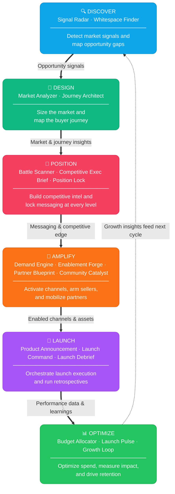
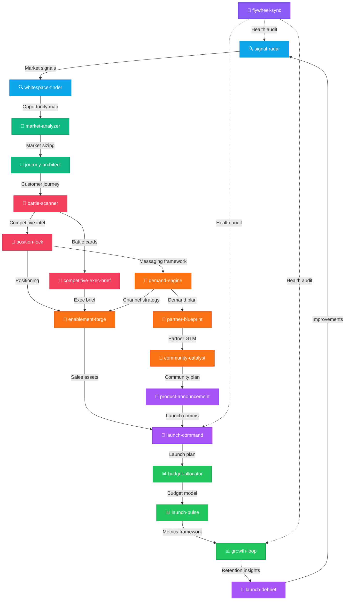

<div align="center">

# 🚀 AI GTM Skill Library

### The 18-Skill AI-Powered Go-To-Market Engine for Claude Code

[]()
[]()
[]()

**A curated library of Claude Code skills that gives AI-first GTM teams a structured, repeatable engine for every phase of go-to-market — from early market signal detection through post-launch retrospectives.** Each skill encodes a proprietary framework that transforms Claude into a domain-specific GTM strategist, eliminating the gap between insight and execution.

</div>

---

## 💡 Why This Matters

> **For AI GTM teams, this library replaces fragmented playbooks and tribal knowledge with 18 composable, AI-native skills that turn strategic analysis into executable plans in minutes — not weeks.** Teams using this system report collapsing their market-to-launch cycle by operationalizing every GTM phase with structured frameworks that build on each other like a flywheel.

---

## 🏗️ Ecosystem Architecture

The skills are organized into **5 strategic phases** that map to the full GTM lifecycle:

```
┌─────────────────────────────────────────────────────────────────────────────┐
│                        AI GTM SKILLS FLYWHEEL                               │
│                                                                             │
│   ┌──────────────┐    ┌──────────────┐    ┌──────────────┐                 │
│   │  🔍 DISCOVER │───▶│  📐 DESIGN   │───▶│  🎯 POSITION │                 │
│   │              │    │              │    │              │                 │
│   │ signal-radar │    │ market-      │    │ position-    │                 │
│   │ whitespace-  │    │  analyzer    │    │  lock        │                 │
│   │  finder      │    │ journey-     │    │ battle-      │                 │
│   │              │    │  architect   │    │  scanner     │                 │
│   │              │    │              │    │ competitive- │                 │
│   │              │    │              │    │  exec-brief  │                 │
│   └──────┬───────┘    └──────┬───────┘    └──────┬───────┘                 │
│          │                   │                   │                         │
│          ▼                   ▼                   ▼                         │
│   ┌──────────────┐    ┌──────────────┐    ┌──────────────┐                 │
│   │  🚀 LAUNCH   │◀───│  📢 AMPLIFY  │◀───│  📊 OPTIMIZE │                │
│   │              │    │              │    │              │                 │
│   │ launch-      │    │ demand-      │    │ budget-      │                 │
│   │  command     │    │  engine      │    │  allocator   │                 │
│   │ product-     │    │ enablement-  │    │ launch-pulse │                 │
│   │  announcement│    │  forge       │    │ growth-loop  │                 │
│   │ launch-      │    │ partner-     │    │ launch-      │                 │
│   │  debrief     │    │  blueprint   │    │  debrief     │                 │
│   │              │    │ community-   │    │              │                 │
│   │              │    │  catalyst    │    │              │                 │
│   └──────────────┘    └──────────────┘    └──────────────┘                 │
│                                                                             │
│          ┌──────────────────────────────────────────┐                       │
│          │  🔄 flywheel-sync (ORBIT System)         │                       │
│          │  Audits health of the entire 18-skill    │                       │
│          │  system with bottleneck analysis          │                       │
│          └──────────────────────────────────────────┘                       │
└─────────────────────────────────────────────────────────────────────────────┘
```

---

## 📋 Skills Catalog

| # | Skill | Framework | Phase | Description |
|---|-------|-----------|-------|-------------|
| 1 | Signal Radar | `PULSE` | Discover | Macro-market signal detection: tech shifts, regulatory changes, buyer behavior, ecosystem dynamics |
| 2 | Whitespace Finder | `DEPTH` | Discover | Maps gaps between market demand and existing solutions with opportunity scoring |
| 3 | Market Analyzer | `SCOPE` | Design | Investment-grade market analysis beyond TAM/SAM/SOM with segment deep dives |
| 4 | Journey Architect | `7-GATE` | Design | End-to-end customer journey with gated progression and friction scoring |
| 5 | Battle Scanner | `ARMOR` | Position | Competitive intelligence with response prediction and battle cards |
| 6 | Competitive Exec Brief | `SHARP` | Position | Executive-ready competitive brief with 1-slide PPTX output |
| 7 | Position Lock | `PRISM` | Position | Brand positioning architecture with L0–L5 message cascade |
| 8 | Demand Engine | `WAVE` | Amplify | Multi-channel demand gen strategy with channel scoring and budget allocation |
| 9 | Enablement Forge | `CRAFT` | Amplify | Sales/marketing asset creation from pitch decks to objection handlers |
| 10 | Partner Blueprint | `BRIDGE` | Amplify | Partner strategy: identify, score, and structure partnerships with co-GTM plans |
| 11 | Community Catalyst | `LOOP` | Amplify | PLG and community strategy with viral loops and K-factor modeling |
| 12 | Product Announcement | `BLAST` | Launch | Coordinated multi-channel launch comms from press release to social to internal |
| 13 | Launch Command | `IGNITE` | Launch | Launch orchestration with 8 workstreams, 4 gates, and go/no-go scoring |
| 14 | Budget Allocator | `APEX` | Optimize | Budget optimization with portfolio theory, scenario analysis, experiment reserves |
| 15 | Launch Pulse | `VITAL` | Optimize | GTM analytics architecture: metrics pyramid, dashboards, alerts, attribution |
| 16 | Growth Loop | `ANCHOR` | Optimize | Retention and expansion strategy with health scoring and advocacy programs |
| 17 | Launch Debrief | `MIRROR` | Launch | Post-launch retrospective with 5-Whys root cause and improvement scoring |
| 18 | Flywheel Sync | `ORBIT` | System | Audits health of the entire 18-skill system with bottleneck analysis |

---

## 🔄 Workflow: Full GTM Lifecycle

From first market signal to post-launch optimization — here's how the six phases connect:



> **Flywheel Sync** (`ORBIT`) operates as a system-wide health layer — it audits connections between all six phases, identifies bottlenecks, and generates improvement roadmaps to keep the entire engine running smoothly.

---

## 🎯 Skill Dependency Map

Each skill produces outputs that feed into downstream skills. Here's the data flow:



---

## ⚡ Quick-Start Workflows

### 🆕 New Market Entry
```
signal-radar → whitespace-finder → market-analyzer → position-lock → demand-engine
```

### 🏁 Product Launch
```
battle-scanner → position-lock → enablement-forge → launch-command → product-announcement → launch-pulse
```

### 📊 Quarterly Strategy Review
```
flywheel-sync → signal-radar → growth-loop → budget-allocator → launch-debrief
```

### 🤝 Partner-Led Expansion
```
market-analyzer → partner-blueprint → community-catalyst → demand-engine → enablement-forge
```

---

## 🛠️ Installation

Each skill is a standalone Claude Code skill file (`SKILL.md`) that can be installed into your Claude Code environment:

```bash
# Clone this repo
git clone https://github.com/varunk130/ai-gtm-skill-library.git

# Copy all skills to your Claude Code skills directory
cp -r ai-gtm-skill-library/skills/* ~/.claude/skills/

# Or install a single skill
cp -r ai-gtm-skill-library/skills/signal-radar ~/.claude/skills/
```

### Directory Structure
```
ai-gtm-skill-library/
├── README.md
├── skills/
│   ├── signal-radar/SKILL.md        # PULSE Framework
│   ├── whitespace-finder/SKILL.md   # DEPTH Framework
│   ├── market-analyzer/SKILL.md     # SCOPE Framework
│   ├── journey-architect/SKILL.md   # 7-GATE Framework
│   ├── battle-scanner/SKILL.md      # ARMOR Framework
│   ├── competitive-exec-brief/SKILL.md # SHARP Framework
│   ├── position-lock/SKILL.md       # PRISM Framework
│   ├── demand-engine/SKILL.md       # WAVE Framework
│   ├── enablement-forge/SKILL.md    # CRAFT Framework
│   ├── partner-blueprint/SKILL.md   # BRIDGE Framework
│   ├── community-catalyst/SKILL.md  # LOOP Framework
│   ├── product-announcement/SKILL.md # BLAST Framework
│   ├── launch-command/SKILL.md      # IGNITE Protocol
│   ├── budget-allocator/SKILL.md    # APEX Framework
│   ├── launch-pulse/SKILL.md        # VITAL Framework
│   ├── growth-loop/SKILL.md         # ANCHOR Framework
│   ├── launch-debrief/SKILL.md      # MIRROR Framework
│   └── flywheel-sync/SKILL.md       # ORBIT System
└── LICENSE
```

---

## 🧠 Framework Quick Reference

| Framework | Mnemonic | Core Concept |
|-----------|----------|--------------|
| **PULSE** | _P_attern, _U_npack, _L_ayer, _S_core, _E_scalate | Detect signals before they become obvious |
| **DEPTH** | _D_emand, _E_xisting, _P_ain, _T_rend, _H_ypothesis | Find gaps others miss |
| **SCOPE** | _S_egment, _C_aliber, _O_pportunity, _P_otential, _E_dge | Size markets with conviction |
| **7-GATE** | Seven decision gates across the buyer journey | Design journeys that convert |
| **ARMOR** | _A_nalyze, _R_ank, _M_ap, _O_utmaneuver, _R_espond | Compete with intelligence |
| **SHARP** | _S_napshot, _H_ead-to-head, _A_ction, _R_isk, _P_itch | Brief executives in 60 seconds |
| **PRISM** | _P_osition, _R_eason, _I_mpact, _S_tory, _M_essage | Lock positioning across levels |
| **WAVE** | _W_here, _A_udience, _V_ehicle, _E_xecute | Drive demand across channels |
| **CRAFT** | _C_ontext, _R_ole, _A_sset, _F_ormat, _T_one | Forge assets that enable sellers |
| **BRIDGE** | _B_uild, _R_each, _I_ntegrate, _D_rive, _G_row, _E_valuate | Bridge to partner ecosystems |
| **LOOP** | _L_aunch, _O_nboard, _O_rchestrate, _P_ropagate | Create community viral loops |
| **BLAST** | _B_rief, _L_aunch, _A_mplify, _S_ync, _T_rack | Blast coordinated launch comms |
| **IGNITE** | 8 workstreams × 4 gates | Orchestrate launches with precision |
| **APEX** | _A_llocate, _P_rioritize, _E_xperiment, _X_-optimize | Optimize budget like a portfolio |
| **VITAL** | _V_isibility, _I_nsight, _T_racking, _A_lert, _L_earn | Build GTM analytics that matter |
| **ANCHOR** | _A_cquire, _N_urture, _C_onvert, _H_old, _O_ptimize, _R_enew | Anchor customers for expansion |
| **MIRROR** | _M_easure, _I_dentify, _R_oot-cause, _R_ecommend, _O_wn, _R_eview | Reflect honestly post-launch |
| **ORBIT** | _O_bserve, _R_ate, _B_ottleneck, _I_mprove, _T_rack | Keep the flywheel spinning |

---

## 🤝 Contributing

We welcome contributions from the Copilot Ecosystems team! To add or improve a skill:

1. Fork this repository
2. Create a feature branch (`git checkout -b improve-skill-name`)
3. Update the `SKILL.md` in the relevant skill directory
4. Submit a Pull Request with a description of your changes

---

## 📄 License

This project is licensed under the MIT License — see the [LICENSE](LICENSE) file for details.

---

<div align="center">

**Built with ❤️ by the Copilot Ecosystems Team**

*Powered by Claude Code Skills*

</div>
