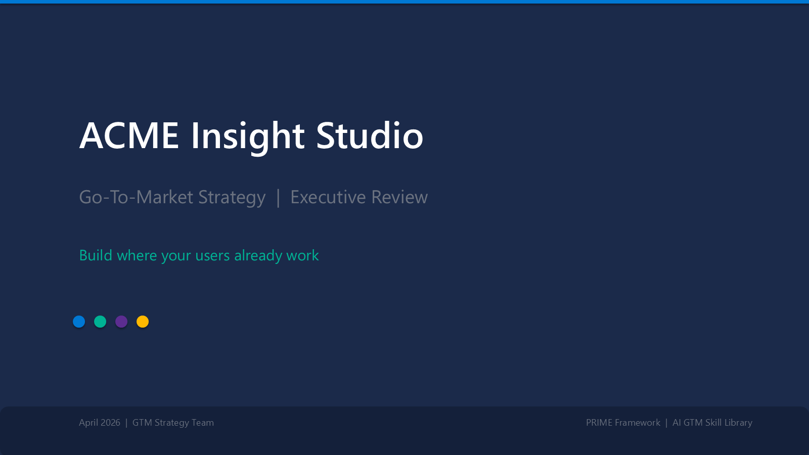
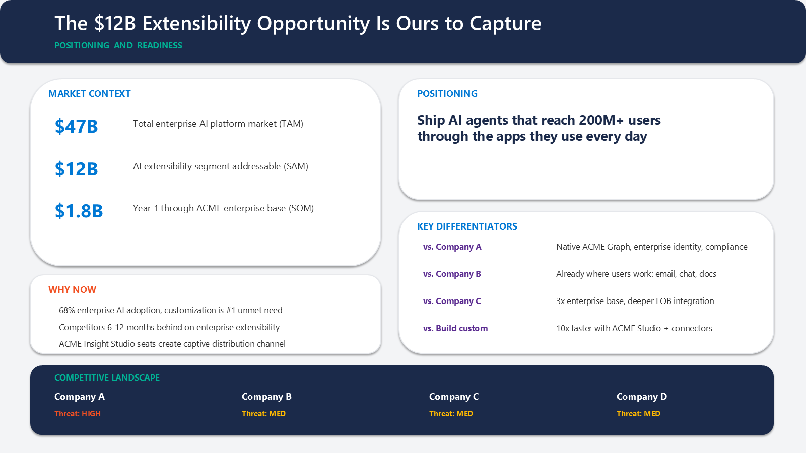
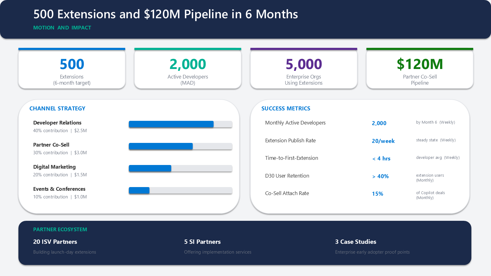
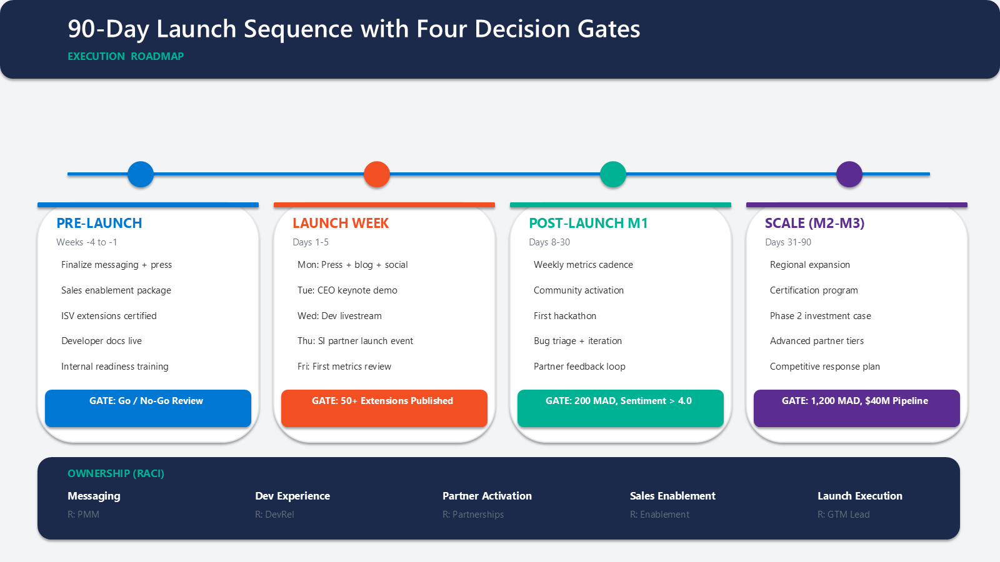
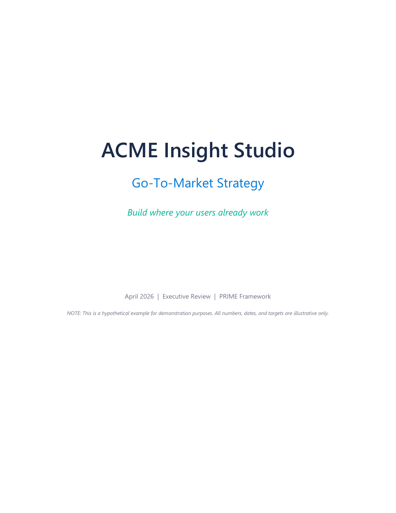
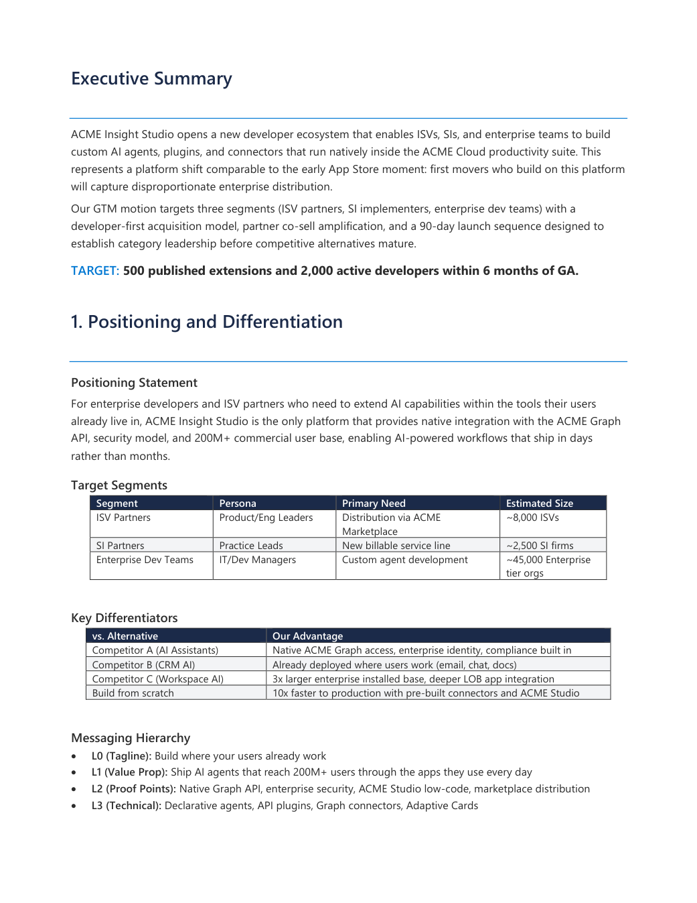
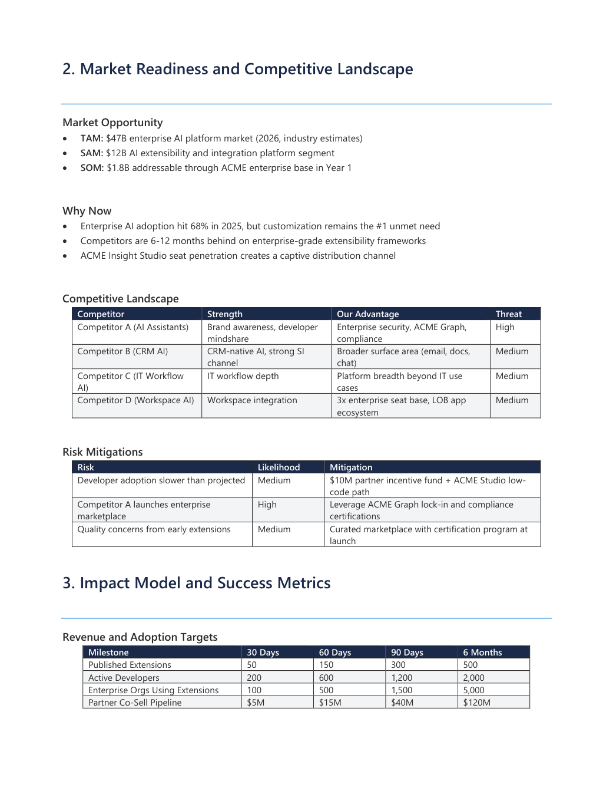
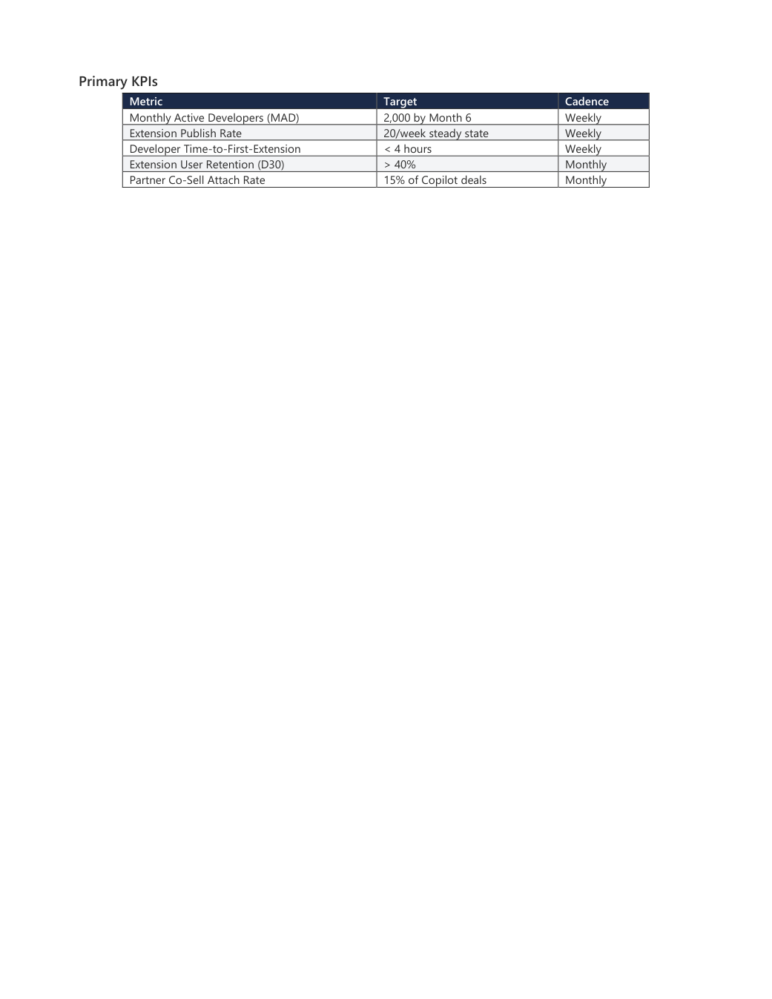
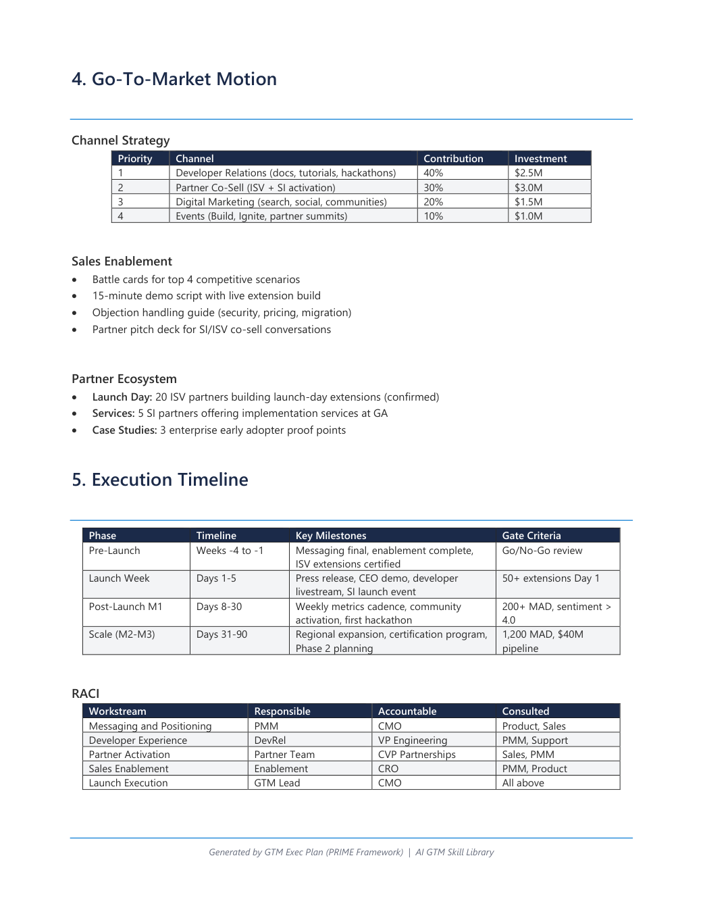

# Samples

Worked examples of skill outputs from the AI GTM Skill Library. All numbers, dates, organization names, and competitive details are **fictional and illustrative** — created to demonstrate the structure and quality of skill outputs, not to make claims about any real product or market.

The featured sample is a complete GTM exec plan for a mock company called **ACME Corporation** launching a fictional product called **ACME Insight Studio**.

---

## ACME Insight Studio — GTM Exec Plan

Produced by the [`gtm-exec-plan`](../gtm-skills/gtm-exec-plan/SKILL.md) skill (PRIME framework). Three artifacts:

| File | What it is | Preview |
|---|---|---|
| [`gtm-plan-acme-insight-studio.md`](./gtm-plan-acme-insight-studio.md) | Readable Markdown version (renders natively on GitHub) | Click to view inline |
| [`gtm-plan-acme-insight-studio.docx`](./gtm-plan-acme-insight-studio.docx) | Formatted Word document (download to view in Word) | Screenshots below |
| [`gtm-plan-acme-insight-studio.pptx`](./gtm-plan-acme-insight-studio.pptx) | 4-slide PowerPoint exec deck (download to view in PowerPoint) | Screenshots below |

> GitHub cannot preview `.docx` or `.pptx` files in the browser. Use the screenshots below to see what the formatted output looks like, or download the file to open in Office.

---

### Executive deck preview (4 slides)

**Slide 1 — Title**



**Slide 2 — Positioning & readiness (market context, positioning, key differentiators, competitive landscape)**



**Slide 3 — Impact & motion (targets, KPIs, channel strategy)**



**Slide 4 — Execution timeline & risk mitigations**



---

### Executive brief preview (5 pages)

The `.docx` is a 3–4 page printable brief that mirrors the deck content with more depth.

| Page | Section |
|---|---|
| 1 | Cover — product, value prop tagline, date, framework |
| 2 | Executive summary + positioning |
| 3 | Market readiness + competitive landscape + risks |
| 4 | Impact model + success metrics |
| 5 | GTM motion + execution timeline |

**Page 1 — Cover**



**Page 2 — Executive summary & positioning**



**Page 3 — Market readiness & competitive landscape**



**Page 4 — Impact model & success metrics**



**Page 5 — GTM motion & execution timeline**



---

## Other samples

| File | What it is |
|---|---|
| [`sample-use-cases.md`](./sample-use-cases.md) | A catalog of worked example use cases across multiple skills |
| [`funnel-analysis-walkthrough.md`](./funnel-analysis-walkthrough.md) | Step-by-step walkthrough using the funnel helper utility |

---

## Regenerating the samples

The brief and deck are fully generated from Python scripts — no manual editing.

```bash
# Requires: python-docx, python-pptx
pip install python-docx python-pptx

# Regenerate the .docx and .pptx
python scripts/generate_sample_brief.py
python scripts/generate_sample_deck.py

# Regenerate the preview screenshots (requires Word + PowerPoint on Windows, plus PyMuPDF and pywin32)
pip install PyMuPDF pywin32
python scripts/render_sample_previews.py
```
